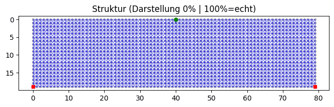
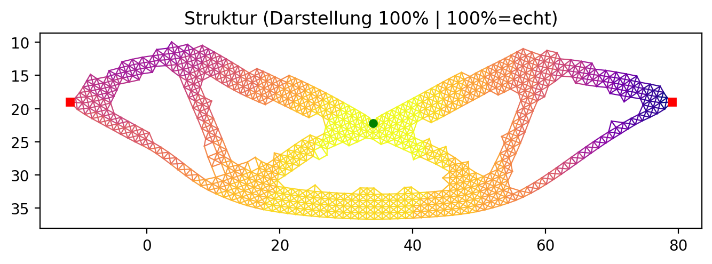

# 2D Topologieoptimierung (Softwaredesign Abschlussprojekt)

**Autoren:** Nico Dörr, Elias Spiegl  
**Semester:** 3 (2025/26)

## Projektziel

Dieses Projekt implementiert eine vereinfachte 2D-Topologieoptimierung in Python mit Streamlit-Web-UI.  
Die Struktur wird als Knotengitter mit linearen Federelementen modelliert (horizontal, vertikal, diagonal).  
Ziel der Optimierung: Material abbauen bei möglichst hoher Steifigkeit (geringer Verformung).

## Technologie-Stack

- Python (objektorientiert)
- Streamlit (Web-UI)
- NumPy (lineare Algebra)
- Matplotlib (Visualisierung, PNG, GIF-Frames)
- Altair (interaktive Modellbearbeitung im Erstellungsmodus)

## Installation & Start

### Voraussetzungen

- Python 3.10+ empfohlen

### Setup

```bash
pip install -r requirements.txt
```

### App starten

```bash
streamlit run main.py
```

Danach ist die App lokal unter `http://localhost:8501` erreichbar.

## Seitenstruktur der App

- **Modell Übersicht**
  - Vorhandene Modelle mit Metadaten anzeigen
  - Modell auswählen, löschen, in Optimierung öffnen
- **Modell Erstellen / Bearbeiten**
  - Neues Modell anlegen oder bestehendes Modell bearbeiten
  - Knoten, Kräfte und Lager interaktiv im Plot setzen
  - Undo/Redo im Editor
- **Modell Optimieren**
  - Optimierungsparameter setzen
  - Lauf starten/stoppen
  - Visualisierung und FEM-Farbskala
  - PNG/GIF/HTML-Report Export

## Mindestanorderungen

die Mindestanforderungen wurden alle erfüllt. darüberhinaus wurden einige Erweiterungen implementiert (siehe "Erweiterungen im Projekt").

## Validierung am MBB-Balken

Die Implementierung wurde am MBB-Balken-Szenario getestet und mit dem automatisch generierten HTML-Bericht ausgewertet.

**Setup & Randbedingungen (MBB-Balken 80x20):**

- Bauraum: `80 x 20` (insgesamt `1600` Knoten)
- Lastfall: `1` externe Kraft
- Lagerung: `2` Lager (Loslager + Festlager)
- Optimierungsziel: Ziel-Masse `50%`, max. Steifigkeitsverlust `70%`

**Ergebnis laut Bericht:**

- Status: `Fertig` nach `49` Iterationen
- Stop-Grund: `Ziel-Masse erreicht`
- Erste Zielerreichung im Verlauf: ca. Iteration `44` bei `49.8%` Masse
- Endzustand: `862 / 1600` aktive Knoten (`53.9%`)
- Maximale Verformung über den Verlauf: `33.738731`
- Glättung nach Optimierung: `1` Schritt
- Historie im Bericht: `95` Verlaufsschritte (inkl. Zwischenzustände)

**Hinweis zur Zielmasse:**

Die Optimierung erreicht die Zielmasse im Verlauf, die finale gespeicherte Masse liegt danach aber leicht darüber.  
Grund ist eine nachgelagerte Glättungsoperation, die dünne/instabile Bereiche stabilisiert und dafür lokal wieder Material ergänzt.

**Optimierung:**



**Verformter Zustand (100% Verformung, Einfärbung = Verschiebung):**



## Deployment

Die Anwendung ist über Streamlit deploybar.

> Platzhalter-Link (später ersetzen):  
`https://your-streamlit-deployment-url.streamlit.app`

## Erweiterungen im Projekt

Zusätzlich zu den Mindestanforderungen wurden folgende Erweiterungen umgesetzt.

### Optimierungslogik

| Erweiterung | Mehrwert | Umsetzung (kurz) |
|---|---|---|
| Dynamische Entfernungsrate | Stabilerer Start, danach schnellere Konvergenz | Frühe Iterationen mit 1.0%, später 1.5% Materialentfernung |
| Sensitivitätsfilter + Pfad-Penalty | Weniger isolierte Ausreißer, robustere Lastpfade | Roh-Sensitivitäten werden nachbarschaftsbasiert geglättet und dünne Pfade zusätzlich bestraft |
| Struktur-Glättung (Stärke 1/2/3) | Besser fertigungstaugliche Geometrie | Diskrete Nachbearbeitung auf dem Optimierungsergebnis, inklusive Undo/Redo |

### Visualisierung & Bedienung

| Erweiterung | Mehrwert | Umsetzung (kurz) |
|---|---|---|
| Erweiterte FEM-Farbvisualisierung | Mehr Analyse statt nur Geometrieansicht | Umschaltbar zwischen Dehnung, Verschiebung und Energie/Länge |
| Elementfokus (Alle, H+V, Diagonal) | Lastabtrag je Elementfamilie besser beurteilbar | Filter in der Plot-Darstellung auf Elementtyp |
| Interaktiver Modell-Editor | Schnelles Definieren und Ändern von Modellen | Knoten, Kräfte und Lager direkt über den Plot setzen/bearbeiten |
| Live-Optimierungsstatus | Transparentes Laufverhalten | Laufende Anzeige von Status, Iteration, Masse und Stop-Grund |

### Export & Nachvollziehbarkeit

| Erweiterung | Mehrwert | Umsetzung (kurz) |
|---|---|---|
| HTML-Berichtsgenerator | Reproduzierbare Ergebnisdokumentation | Modellmetadaten, Kennzahlen und Verlaufsdiagramme in einem Report |
| GIF on-demand | Geringe Laufzeitkosten im normalen Betrieb | Animation wird nur bei Klick erzeugt, nicht bei jedem Lauf |
| Persistente Modellhistorie | Nachvollziehbare Entwicklungs- und Optimierungsschritte | Historie über Bearbeitung, Optimierung und Glättung wird gespeichert |

## UML (Mermaid)


Mermaid-Quelle: `docs/UML_Klassendiagramm.mmd`

## Quellen

- Streamlit: https://docs.streamlit.io/
- NumPy: https://numpy.org/doc/
- Matplotlib: https://matplotlib.org/stable/users/index.html
- Altair: https://altair-viz.github.io/
- OpenAI LLM-Unterstützung (UI-Ideen, Refactoring-Hilfe, Textarbeit)

## Hinweis zur KI-Unterstützung

Bei der UI-Ausarbeitung wurden KI-gestützte Vorschläge als Unterstützung genutzt (insbesondere für Layout-Iterationen mit Streamlit).  
Architektur, fachliche Entscheidungen, Implementierung und finale Integration wurden projektseitig umgesetzt und geprüft.
